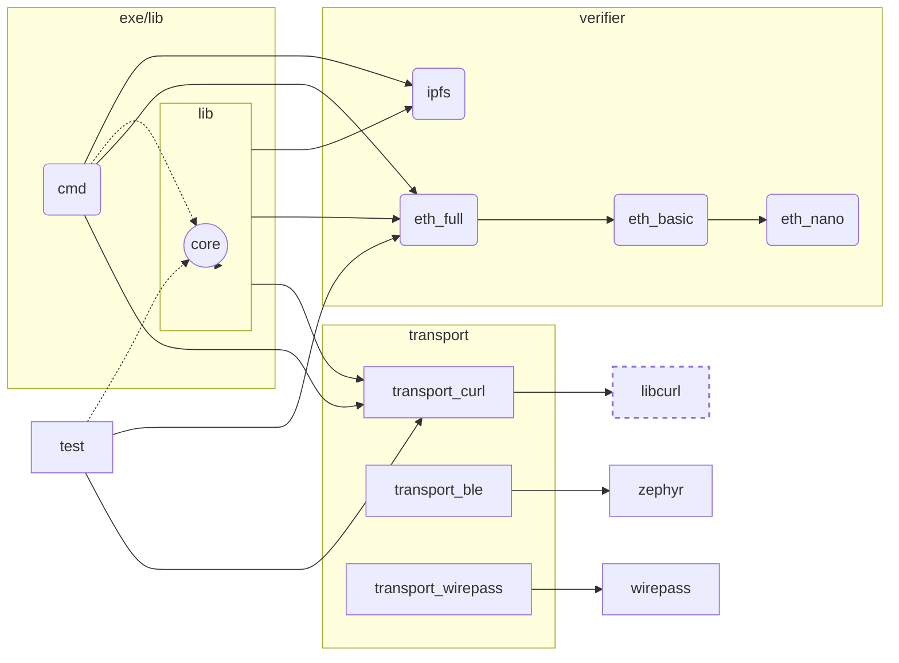

This library contains the core API + management of the nodeList as well as the capability to sign requests

Within the src-folder there are different modules used create the binaries matching the requirements of the device.

