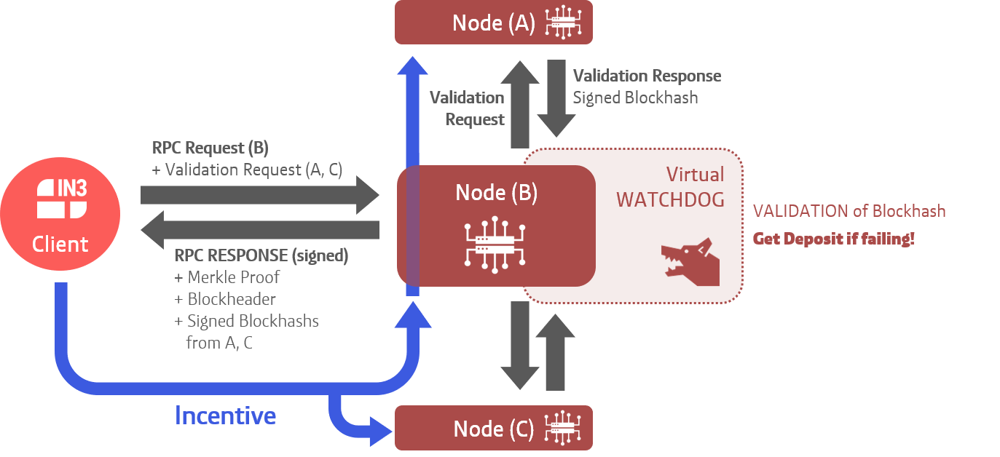

# Incubed Client in C
 [](https://github.com/slockit/in3-c/network/members)
  [](https://github.com/slockit/in3-c/watchers)
  [](https://github.com/slockit/in3-c/blob/master/LICENSE.AGPL)
 
The **Incubed** client is a
* Crypto-Economic 
* Non-syncronizing and stateless, but fully verifying
* Minimal resource consuming

blockchain client (Crypto-Economic Client, Minimal Verification Client, Ultra Light Client). This version is written in C.

Most blockchains, such as Ethereum, require a client to connect to their blockchain network. Often, these clients 
require a lot of storage, a very high bandwidth or constant computation. While this is possible to perform on laptops or desktop systems, 
mobile devices, mobile app, and even web applications struggle to meet these requirements. Currently the solution of choice is to use a 
light client or remote client on mobile devices. While this may work for mobile phones, most IoT devices are unable to run light clients. 
Connecting an IoT device to a remote node enables even low-performance IoT devices to be connected to blockchain. However, by using distinct 
remote nodes, the advantages of a decentralized network are undermined introducing a single point of failure. Also, it is unsecure because 
the client is not able to verify the results by itself. The same applies for mobile apps or web pages.
The Trustless Incentivized Remote Node Network, in short **Incubed**, makes it possible to establish a 
decentralized and secure network of remote nodes and clients which are able to verify and validate the results, enabling trustworthy and 
fast access to blockchain for a large number of low-performance IoT, mobile devices, and web applications.

 
 
 
 A more detailed explanation of in3 can be found [here](https://in3.readthedocs.io/en/latest/intro.html).
  
  For information on the in3-node, please go [here](https://github.com/slockit/in3-server).
  
  For information on the in3 typescript client, please go [here](https://github.com/slockit/in3).
  
 ## Installation and Usage
 | package manager / Bindings | Link  | Use case |
|:-------------|  ----:| :-----|
|  Ubuntu Launchpad     | [](https://launchpad.net/~devops-slock-it/+archive/ubuntu/in3)  | Installs libs and binaries on IoT devices or Linux-Systems <br><br>*Add the slock.it ppa to your system*<br>`sudo add-apt-repository ppa:devops-slock-it/in3`<br><br>*install the commandline tool in3*<br>`apt-get install in3`<br><br>*install shared and static libs and header files*<br>`apt-get install in3-dev` |
| Docker Hub |  [](https://hub.docker.com/r/slockit/in3)   |  Quick and easy way to get in3 client running as docker container<br>`docker run -d -p 8545:8545 slockit/in3:latest --chainId=goerli -port 8545`<br> More parameters and their descriptions can be found [here](https://in3.readthedocs.io/en/latest/getting_started.html#as-docker-container).|
| Brew      |  []( https://github.com/slockit/homebrew-in3) | Easy to install on MacOS<br><br>*Add a brew tap* <br>`brew tap slockit/in3`<br><br>*install all binaries and libraries*<br>`brew install in3`
| Release page | [](https://github.com/slockit/in3-c/releases) | Releases including precompiled libraries for major platforms. To build or compile against the incubed, see [readthedocs](https://in3.readthedocs.io/en/latest/api-c.html).
 | WASM |[](https://www.npmjs.com/package/in3-wasm ) | a WASM-Based npm module running in browsers or nodjs.<br>`npm install --save in3-wasm`<br>See [examples](https://github.com/slockit/in3-c/blob/latest/examples/js/get_block_rpc.js) on how to use it.
 | Java |[](https://github.com/slockit/in3-c/releases) | For integrating with java applications. Take the jar-file from the release. <br>`javac -cp $IN3_JAR_LOCATION/in3.jar *.java`<br> For infromation on how to use maven, examples and documentation see [readthedocs](https://in3.readthedocs.io/en/latest/api-java.html)


 
 ## Example 
 
 Please have a look at the examples folder in the repo for more detailed [examples](https://github.com/slockit/in3-c/tree/master/examples). 
 
 ### CLI
  in3 can be used on the command line in this manner: 
  
  ```in3 [options] method [arguments]```
  
  For example,
  
  To get block number, run: 
  ```
  > in3 eth_blockNumber
  8610795
  ``` 
  
  A more detailed list with information on arguments can be found [here](https://in3.readthedocs.io/en/latest/api-cmd.html).
  
 ### C Code
 Example C code can be found [here](https://github.com/slockit/in3-c/tree/master/examples/c)
 ```c
#include <in3/client.h>    // the core client
#include <in3/eth_basic.h> // use the basic module
#include <in3/in3_curl.h>  // transport implementation
#include <inttypes.h>
#include <stdio.h>

int main(int argc, char* argv[]) {
  // register a chain-verifier for basic Ethereum-Support, which is enough to verify blocks
  in3_register_eth_basic();

  in3_register_curl(); // use curl as the default for sending out requests

  in3_t* in3 = in3_for_chain(ETH_CHAIN_ID_MAINNET); // create new incubed client
 
  char *result, *error;  // prepare 2 pointers for the result.

  in3_ret_t res = in3_client_rpc(   // send raw rpc-request, which is then verified
      in3,                    //  the configured client
      "eth_getBlockByNumber", // the rpc-method you want to call.
      "[\"latest\",true]",    // the arguments as json-string
      &result,                // the reference to a pointer whill hold the result
      &error);                // the pointer which may hold a error message

  if (res == IN3_OK) {
    printf("Latest block : \n%s\n", result);
    free(result);
  } else {
    printf("Error verifing the Latest block : \n%s\n", error);
    free(error);
  }
  in3_free(in3);   // cleanup client after usage

}
 ```
 A more detailed example with information on how to call functions can be found [here](https://in3.readthedocs.io/en/latest/api-c.html#examples).
 


 ## Features
 
 |                            | in3  | Remote Client | Light Client | 
 | -------------------------- | :----------------: | :----------------: |  :----------------: |
 | Failsafe connection        |         ✔️         |     ❌     |  ✔️ |
 | Automatic Nodelist updates |         ✔️         |     ❌     |  ✔️ | 
 | Partial nodelist           |         ✔️         |     ❌     |  ✔️ |
 | Multi-chain support        |         ✔️         |      ✔️    |  ❌ |
 | Full verification of JSON-RPC methods   |         ✔️         |  ❌  | ❌  |
 | IPFS support               |         ✔️         |    ✔️    |  ❌ |
 | Caching support            |         ✔️         |    ❌      |  ❌ |
 | Proof-Levels               |         ✔️         |    ❌      |  ❌ |
 | POA Support                |         ✔️         |    ✔️    |  ✔️   |
 | Database setup size-minutes|        0-instant️   |    0-instant    |  ~50Mb-minutes️ |
 | Uses                       |         IoT devices,Mobile,browser️ |    Mobile,browser️️    |  PC,Laptop️   |
 
 ## Resources 
 
 * [C API reference](https://in3.readthedocs.io/en/latest/api-c.html)
 * [C examples](https://in3.readthedocs.io/en/latest/api-c.html#examples)
 * [in3-node](https://github.com/slockit/in3-server)
 * [in3 typescript client](https://github.com/slockit/in3)
 * [Website](https://slock.it/incubed/) 
 * [ReadTheDocs](https://in3.readthedocs.io/en/latest/)
 * [Blog](https://blog.slock.it/)
 * [Incubed concept video by Christoph Jentzsch](https://www.youtube.com/watch?v=_vodQubed2A)
 * [Ethereum verification explained by Simon Jentzsch](https://www.youtube.com/watch?v=wlUlypmt6Oo)
 
 ## Contributors welcome!
 
 We at Slock.it believe in the power of the open source community. Feel free to open any issues you may come across, fork
  the repository and integrate in your own projects. You can reach us on various social media platforms for any questions
  and suggestions.  
 
 [](https://twitter.com/slockitproject?s=17)
 [](https://blog.slock.it/)
 [](https://www.youtube.com/channel/UCPOrzp3CZmdb5HJWxSjv4Ig)
 [](https://www.linkedin.com/company/10327305)
 [](https://gitter.im/slockit-in3/community?utm_source=badge&utm_medium=badge&utm_campaign=pr-badge) 

## Got any questions?
Contact us on [](https://gitter.im/slockit-in3/community?utm_source=badge&utm_medium=badge&utm_campaign=pr-badge) or
send us an email at <a href="mailto:team-in3@slock.it">team-in3@slock.it</a>


## LICENSE

### COMMERCIAL LICENSE 

Licensees holding a valid commercial license may use this software in accordance 
with the commercial license agreement provided with the Software or, alternatively, 
in accordance with the terms contained in a written agreement between you and 
slock.it GmbH/Blockchains LLC. For licensing terms and conditions or further 
information please contact slock.it at in3@slock.it.
	
Alternatively, this software may be used under the AGPL license as follows:
   
### AGPL LICENSE 

This program is free software: you can redistribute it and/or modify it under the 
terms of the GNU Affero General Public License as published by the Free Software 
Foundation, either version 3 of the License, or (at your option) any later version.
 
This program is distributed in the hope that it will be useful, but WITHOUT ANY 
WARRANTY; without even the implied warranty of MERCHANTABILITY or FITNESS FOR A 
PARTICULAR PURPOSE. See the GNU Affero General Public License for more details.
[Permissions of this strong copyleft license are conditioned on making available 
complete source code of licensed works and modifications, which include larger 
works using a licensed work, under the same license. Copyright and license notices 
must be preserved. Contributors provide an express grant of patent rights.]
You should have received a copy of the GNU Affero General Public License along 
with this program. If not, see <https://www.gnu.org/licenses/>.