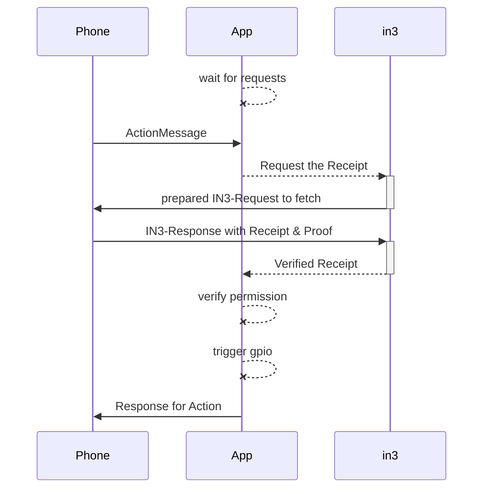
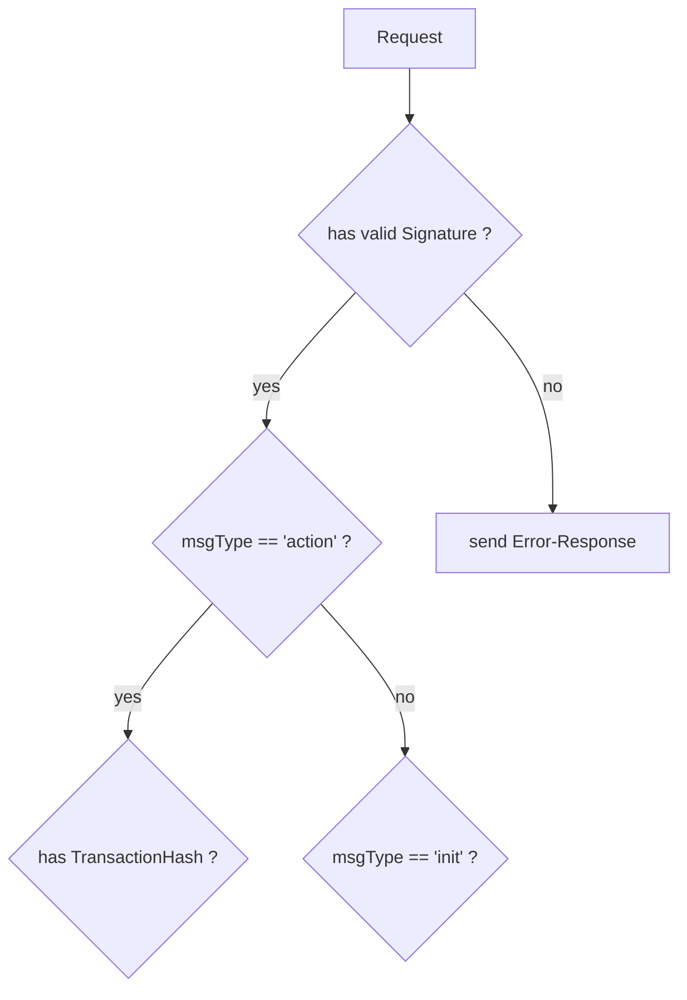

USN-Application with in3-core

```mermaid
sequenceDiagram

    participant Phone
    participant App
    participant in3

    App--xApp: wait for requests
    Phone->>App: ActionMessage
    App-->>+in3: Request the Receipt
    in3->>-Phone: prepared IN3-Request to fetch
    Phone->>+in3: IN3-Response with Receipt & Proof
    in3-->>-App: Verified Receipt
    App--xApp: verify permission 
    App--xApp: trigger gpio 
    App->>Phone: Response for Action

```

# Verification-Flow

```mermaid
graph TD
    
    req[Request] --> hasSignature{ has valid Signature ? }
    hasSignature -- yes --> isAction{ msgType == 'action' ? }
    hasSignature -- no --> reject[ send Error-Response ]
    
    isAction -- yes --> hasTransaction{ has TransactionHash ? }
    isAction -- no --> isInit{ msgType == 'init' ? }
    
    
    
```