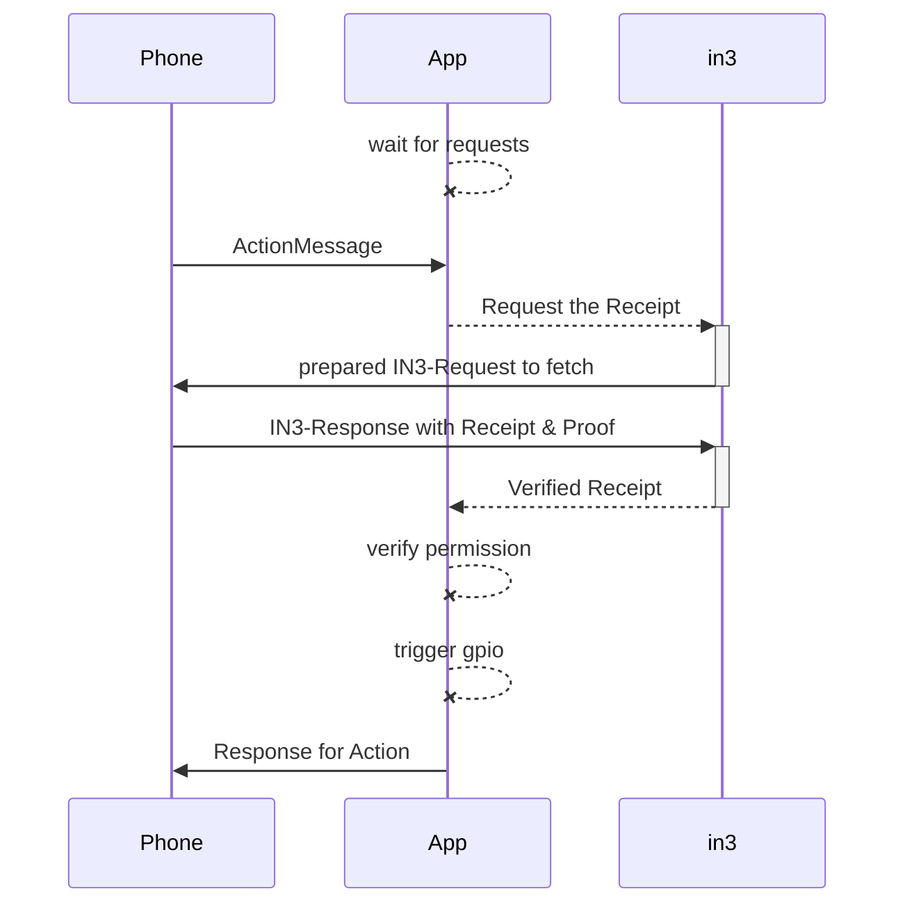
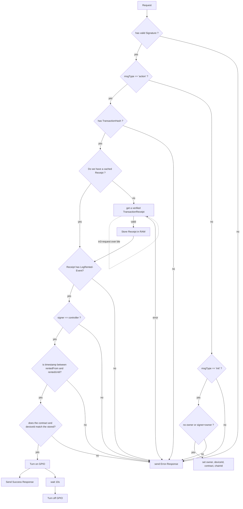

USN-Application with in3-core

The Application is receiveing a BLE-Message and verifies it. If valid a GPIO is triggered.

The main Participants in this process is :

1. The sender of the Message (`Phone`)
2. The proccessor (`App`) which is the main-Application on the board.
3. the incubed-Library (`in3`) which is handling the verification.



# Verification-Flow





# Minimal Verification Implementation

The Application will simply accept a request to trigger a action. This request will then be verified and executed by chaing the state of a GPIO-Pin. The Application will be responsible to create the communication-layer, which is done as a bluetooth-connection.

### Communication-Layer
The Bluetooth-Connection will enable to send simply messages from the device and to the device. This means after the pairing, The CommunicationLayer implements a function for sending and receiving Messages:

```c
typedef int (*in3_transport_send)(char** urls, int urls_len, char* payload, in3_response_t* results);
```

Once the ble-response has been received the results-array is offers structs like :

```c
/** response-object. 
 * 
 * if the error has a length>0 the response will be rejected
 */
typedef struct {
  sb_t error;  /**< a stringbuilder to add any errors! */
  sb_t result; /**< a stringbuilder to add the result */
} in3_response_t;
```

The implemenation simply needs to add the response to either result or error:

```c
sb_add_chars(&result->result, received_data);
```

## Incoming Requests

The payload of a request is a json-object which looks like this:

```js
{
    /** 
     * identifier of the message in order to avoid duplicate messages.
     */
    msgId: number
    /**
     * marks the type of a message
     */
    msgType: 'init' | 'action' | 'in3Request'| 'in3Response'

    /**
     * the human readable url of the device
     * example: bike@myCompany
     */
    url: string

    /**
     * Unix format timestamp (in seconds) of the message. Used to avoid using same message twice.
     */
    timestamp: number
    
}
```

Depending on the msgType, the object holds additional properties:

### Type: `init`

This message will store a new owner and contract. It can only be called, if:
- the owner provided the correct signature
- the owner is not set yet or the same as the current owner.

```js
{
  /**
   * hex address of the new or old owner of the device. (20bytes)
   */
  owner: string // hex

  /**
   * chainId of the contract as hexstring (32bytes)
   */
  chainId: string

/**
   * address of the contract (20bytes)
   */
  contract: string

  /**
   * deviceId as hexstring (32bytes)
   */
  deviceId: string

  /**
   * gpio-pin to trigger.
   * At the moment we only support action for open => set GPIO to 1 and close => set GPIO to 0
   */
  gpio: number

  /** 
   * signature of the sender of the message
   */
  signature: {
      /**
       * the message as conacted string (optional)
       */
      message?: string
      /**
       * hash of the message (sha3)
       */
      messageHash: string // bytes32
      /**
       * Positive non-zero Integer signature.r
       */
      r: string // hex
      /**
       * Positive non-zero Integer signature.s
       */
      s: string // hex
      /**
       * Calculated curve point, or identity element O.
       */
      v: string // hex
      /**
       * optional: the concated signature of r+s+v
       */
      signature?: string // hex
  }

}
```

a request should be handled by following these steps:

1. building the messagehash:

   ```ts
   const message = msg.owner + msg.chainId + msg.contract + msg.deviceId + msg.gpio;
   const messageHash = sha3(message);
   ```
2. verifiying the messageHash of the incoming request (`msg.signature.messageHash == messageHash` )
3. getting the signer of the message

   ```ts
   const signer = pubToAddress( ecrecover(messageHash, msg.signature.v, msg.signature.r, msg.signature.s ))
   ```
4. verifying that either there is no owner or the current owner == signer
5. setting the values ( `msg.owner`, `msg.chainId`, `msg.contract`, `msg.deviceId` and `msg.gpio`) in the permanent storage
6. returning a simple response:

   ```js
   {
      msgId : msg.msgId,
      result: 'success' | 'error'
   }
   ```


### Type: `action`

A Action message will trigger a GPIO to change it's state.

```js
{
     /**
     * Abstract physical action. Right now only 'open' (GPIO:1) and 'close' (GPIO:0) are supported.
     */
    action: string
    /**
     * optional Object containing data that the physical device expects to trigger change of state.
     */
    metadata?: any

    /**
     * the chain of the contract used.
     */
    chainId?: string

    /**
     * the transactionHash of the transaction the user sent in order to rent this device.
     */
    transactionHash?: string

    /** 
     * signature of the sender of the message
     */
    signature: {
        /**
         * the message as conacted string (optional)
         */
        message?: string
        /**
         * hash of the message (sha3)
         */
        messageHash: string // bytes32
        /**
         * Positive non-zero Integer signature.r
         */
        r: string // hex
        /**
         * Positive non-zero Integer signature.s
         */
        s: string // hex
        /**
         * Calculated curve point, or identity element O.
         */
        v: string // hex
        /**
         * optional: the concated signature of r+s+v
         */
        signature?: string // hex
    }
    
}
```

#### proccessing a action-message:

1. verifying the transaction, by asking incubed for the Receipt.
   
   ```c
	sprintf(params, "[\"%s\"]", tx_hash);
    in3_ctx_t* ctx = in3_client_rpc_ctx(in3,"eth_getTransactionReceipt",params);
    
    // read the data
    d_token_t* receipt = d_get(ctx->responses[0], K_RESULT);
    
        
    if (!receipt) {

        d_token_t* error = d_get(ctx->responses[0], K_ERROR);
        // report error (either error or ctx->error) and reject
        free_ctx(ctx);
        return -1;
    }
        
        
    // read and verify the receipt....
    
    free_ctx(ctx);
   ```
   
2. checking for an LogRented-Event in the response

   ```js 
   // make sure the receipt exists
   if (!response[0].result) throw new Error()
   const logs = repsonses[0].result.logs
   // and has logs
   if (!logs || logs.length===0) throw new Error()
   for (const log of logs) {
     if (log.topics && log.topics[0]==='0x9123e6a7c5d144bd06140643c88de8e01adcbb24350190c02218a4435c7041f8') { //signature of the logRentedEvent
       // found a event
       const deviceId = log.topics[2] // the deviceId
       const controller = '0x'+log.data.substr(26,40) // address of the controller
       const rentedFrom = parseInt(log.data.substr(2+64,64),16) // the timestamp of rentedFrom
       const rentedUntil= parseInt(log.data.substr(2+2*64,64),16) // the timestamp of rentedFrom
     }
   }
   ```

3. if the event was found, we need to verify the signature

   ```js
   const message = msg.url + msg.timestamp + msg.action +JSON.stringify(msg.metadata) // in our case JSON.stringify(msg.metadata) is always '{}'
   const messageHash = sha3(message);
   ```
4. verifiying the messageHash of the incoming request (`msg.signature.messageHash == messageHash` )
5. getting the signer of the message

   ```ts
   const signer = pubToAddress( ecrecover(messageHash, msg.signature.v, msg.signature.r, msg.signature.s ))
   ```
6. checking if the booking is valid:
   ```js
   const now = Math.round(Date.now()/1000) // get the current unix timestamp in s
   if (signer == controller && rentedFrom<now && rentedUntil>now && storage.deviceId==deviceId)
      // trigger gpio
   else
      throw new Error('no access')
   ```
7. trigger thr GPIO (if valid)
8. returning a simple response:

   ```js
   {
      msgId : msg.msgId,
      result: 'success' | 'error'
   }
   ```


### Type: `in3Response`

A message of type `in3Response` will be handled as response from a in3-request and its `responses` should be passed directly to the in3-library.

```ts
{
  /**
   * array of json-rpc-responses.
   */
  responses: {
    /**
     * json-rpc-version : '2.0'
     */
    jsonrpc: string

    /**
     * request-id
     */
    id: number | string

    /**
     * the result of the request
     */
    result: any

    /**
     * the error in case it failed
     */
    error: any

    /**
     * the in3-data including the proof
     */
    in3?:any

  }[]
}
```
### Type: `Bluetooth`

All the communication from the device (HW) to the App (smartphone) and viceversa takes place through Bluetooth BLE. The Bluetooth BLE stack is not conceptually complex, but has A LOT of capabilites and modes of use.
In the in3-core "/src/zephyr" subfolder you can find a working implementation of such communication. Please note that this is NOT the only way to do the job, it's just one of the possible implementations.
In the firmware (the device), the BLE acts like a server while the App (smartphone) is the client. This means that the server does not send data if there isn't a request from the client.
When you start the BLE stack, you have to define the environment. This means that you have to define the "objects" that will be used.
In the canonical description, every "object" is called "characteristic". The characteristic has some fields that have to be defined.

Every "object" is identified by a "name": this is a unique code of 16 bytes (called UUID).
```ts
// define an UUID for msg_svc (BT_GATT_PRIMARY_SERVICE)
static struct bt_uuid_128 msg_svc_uuid = BT_UUID_INIT_128(
	0x01, 0xde, 0xbc, 0x9a, 0x78, 0x56, 0x34, 0x12,
	0x78, 0x56, 0x34, 0x12, 0x78, 0x56, 0x34, 0x12);
```
In this case we defined the primary service, or the "container" for all the services. Note that on the App side you will find such UUID in reverse order and in form of a string:
```ts
msg_svc_uuid = "1234567812345678123456789abcde01".
```

The full BLE environment for this project is set here:
```ts
static struct bt_gatt_attr msg_attrs[] = {
		BT_GATT_PRIMARY_SERVICE(&msg_svc_uuid), // [0] primary service

////////////////////////////////////////////////////////////////////////
		BT_GATT_CHARACTERISTIC(&msg_char_uuid.uuid, // [1] characteristic attribute uuid
			BT_GATT_CHRC_WRITE, // char att properties
			BT_GATT_PERM_WRITE | BT_GATT_PERM_PREPARE_WRITE, // char att permissions
			NULL, rx_data, recv_buf_static), // char att read callback, write callback, value

		BT_GATT_CHARACTERISTIC(&req_char_uuid.uuid, // [2] characteristic attribute uuid
			BT_GATT_CHRC_READ, // char att properties
			BT_GATT_PERM_READ, // char att permissions
			read_req, NULL, req_buf), // char att read callback, write callback, value

		BT_GATT_CHARACTERISTIC(&notify_uuid.uuid, // [3] characteristic attribute uuid
			BT_GATT_CHRC_NOTIFY, // char att properties
			BT_GATT_PERM_NONE, // char att permissions
			NULL, NULL, NULL), // char att read callback, write callback, value
////////////////////////////////////////////////////////////////////////

		BT_GATT_CCC(req_ccc_cfg, req_ccc_cfg_changed), // [4] initial config, callback to configuration change
};
```
So, as you can see, we have a GATT (Generic ATTribute) that defines:
```ts
[0] the primary service (the container)
[1] one channel / service that has the property to be writeable, the permission to write and the callback for the event rised when a request comes from BLE stack. Also, there is a pointer to the buffer that will contain the data. In the example the callback is "rx_data" and the buffer is "recv_buf_static"
[2] one channel / service that has the property to be readable, the permission to read and the callback for the event rised when a request comes from BLE stack. In the example the callback is "read_req" and the buffer pointer is "req_buf"
[3] one channel / service that has the property of "notify" and no permissions. The "notify" property is the way the server uses to communicate to the client that has to read some data from the server
[4] the low-level communication service. This is used, for example, when the App tries to modify the standard MTU. The MTU is the standard packet size used by the protocol to rend / receive data.
```
So, when the App wants to send data to the device, it uses the characteristic [1] of the GATT service [0];
when the App wants to read data from the device, it uses the characteristic [2] of the GATT service [0];
when the device wants to notify to the App that there is something to read, it simply writes to the characteristic [3].
The low-level protocol will send, in this case, the notification flag that is captured by the App. Consequently the App will send the appropriate command and read the data.

An example of this mechanism is in this code:
```ts
void bluetooth_write_req(char *msg)
{
	k_mutex_lock(&client->mutex, 5000);

	if (strlen(msg) > sizeof(recv_buf_static)) // EFmod: may be req_buf ?
		return;

	strcpy(req_buf, msg);
	dbg_log("<--- buffer prepared for req_char:\n%s\n", req_buf);

	k_mutex_unlock(&client->mutex);

	dbg_log("send notification for REQ\n");

	char *send = "REQ_READY";
//  EFmod: the "normal" [3] does not work. Index [5] is out of bounds, but it works...
	bt_gatt_notify(NULL, &msg_attrs[5], send, strlen(send));
}
```
Note the last row: the BT command is bt_gatt_notify. This will send a low-level message to the App. Before sending this command we have copied the data (from msg) to the req_buf, that is used for storing the data that the App will READ.

Another important part is the MTU, or the size of the elementary communication packet. As default, the MTU start with the value 23 (3 bytes header + 20 bytes data), but to speed up the communication, the App can send a request (on the low-level communication layer) and try to increase it.
The App, after sending such command, receives an answer from the device, with the current MTU. The device will NOT accept in every case the proposed value. It will return a value that is the one can be used, so the App must use this as current MTU.
When the App reads data from the device, and the data length is bigger than the MTU, the BLE stack will automatically split the data in many subpackets that will be received, one at a time, from the App.
The same does NOT apply to the data sent from the App to the device. If the data that you have to send is longer than the MTU, YOU have to split it in shorter packets. Look at the source below (part of rx_data function):
```ts
	if (len == 0x8) {
		char magic[17];
		char *header = (char *) buf;
		if (total_len > 0) {
			dbg_log("<--- Channel already open, dismissing new request\n");
			return BT_GATT_ERR(BT_ATT_ERR_WRITE_REQ_REJECTED);
		}
		sprintf(magic, "%02x%02x%02x%02x%02x%02x%02x%02x", header[0], header[1],
			header[2], header[3], header[4], header[5], header[6], header[7]);
		if (header[0] == 0x69 &&
		    header[1] == 0x6e &&
		    header[2] == 0x33 &&
		    header[3] == 0x63) {
			dbg_log("<--- Magic: 0x%s\n", magic);
			if (start_message(*((int *) buf+1)))
				{
				dbg_log("<--- offset error\n");
				return BT_GATT_ERR(BT_ATT_ERR_INVALID_OFFSET);
				}
			bluetooth_clear_req();
			return len;
		}
	}
```
The "trick" is very simple. I suggest to have a look at the C sources of the hw-test FW in in3-c/samples and also to look at the test App sources to see both the ends of the BT communication process. For example, if we have to send 400 bytes of data and the MTU is lower, for example if it is just 20 (remember, the real space is MTU -3, cause the 3 bytes of header is a fix value) then we initially send a packet that contains a "magical number" plus the true data length (400 in this case).
In the C source you can read: if the received packet length is 8 and if the first 4 bytes are the "magical number" then this packet is a start of one splitted transmission. So, in that case, the buffers are cleared, the counters necessary for joining the splitted packets are initialized and then all is ready to receive the next small packets. Every packet is queued to the previous in the "big receive buffer" and when the total of received data is equal the the one received in the "magical" packet, then the receiption is complete and you can handle the data.
The "magical number" used in the C source is 0x696e3363. I used, in my hw-test, a different one: 0xF0CACC1A, just 'cause I found it in some memory integrity check function and I agreed with the authors: FOCACCIA is better than DEADBEEF.


