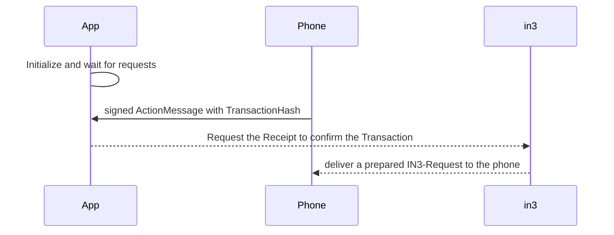

USN-Application with in3-core

```mermaid
sequenceDiagram
    App->App: Initialize and wait for requests
    Phone->>App: signed ActionMessage with TransactionHash
    App-->>in3: Request the Receipt to confirm the Transaction
    in3-->>Phone: deliver a prepared IN3-Request to the phone
    
```

```mermaid
graph TD
    
    Request
    
    
```