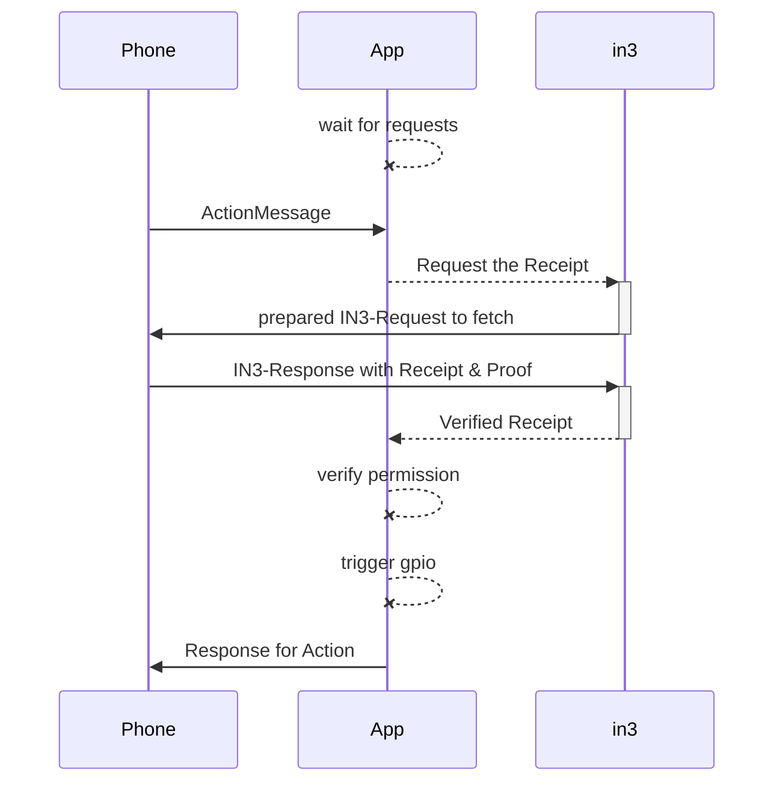
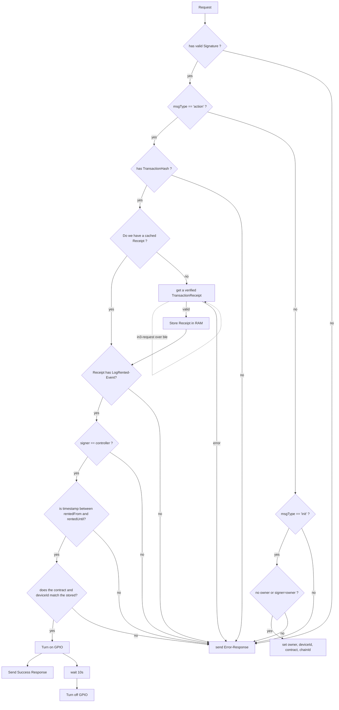

USN-Application with in3-core

The Application is receiveing a BLE-Message and verifies it. If valid a GPIO is triggered.

The main Participants in this process is :

1. The sender of the Message (`Phone`)
2. The proccessor (`App`) which is the main-Application on the board.
3. the incubed-Library (`in3`) which is handling the verification.



# Verification-Flow





# in3-c
a c-implementation of the incubed client

# Minimal Verification Implementation

## Requirements or extern libs

- Keccack256
- ecrecovery 
- bluetooth stack
- rlp-encoding (See https://github.com/ethereum/cpp-ethereum/blob/develop/rlp/main.cpp)

## The Application

The Application will simply accept a request to trigger a action. This request will then be verified and executed by chaing the state of a GPIO-Pin. The Application will be responsible to create the communication-layer, which is done as a bluetooth-connection.

### Communication-Layer
The Bluetooth-Connection will enable to send simply messages from the device and to the device. This means after the pairing, The CommunicationLayer will offer 2 functions for sending and receiving Messages:

- `Response sendMessage(Request request)`
- `onRequest(Function<Request=>Response>)`

This layer will be used by the Application, but also by the Incubed-Library.

The payload of a request is a json-object which looks like this:

```js
{
    /** 
     * identifier of the message in order to avoid duplicate messages.
     */
    msgId: number
    /**
     * marks the type of a message
     */
    msgType: 'setup' | 'action' | 'in3Request'| 'in3Response'

    /**
     * the human readable url of the device
     * example: bike@myCompany
     */
    url: string

    /**
     * Unix format timestamp (in seconds) of the message. Used to avoid using same message twice.
     */
    timestamp: number
    
}
```

Depending on the msgType, the object holds additional properties:

### Type: `setup`

This message will store a new owner and contract. It can only be called, if:
- the owner provided the correct signature
- the owner is not set yet or the same as the current owner.

```js
{
  /**
   * hex address of the new or old owner of the device. (20bytes)
   */
  owner: string // hex

  /**
   * chainId of the contract as hexstring (32bytes)
   */
  chainId: string

/**
   * address of the contract (20bytes)
   */
  contract: string

  /**
   * deviceId as hexstring (32bytes)
   */
  deviceId: string

  /**
   * gpio-pin to trigger.
   * At the moment we only support action for open => set GPIO to 1 and close => set GPIO to 0
   */
  gpio: number

  /** 
   * signature of the sender of the message
   */
  signature: {
      /**
       * the message as conacted string (optional)
       */
      message?: string
      /**
       * hash of the message (sha3)
       */
      messageHash: string // bytes32
      /**
       * Positive non-zero Integer signature.r
       */
      r: string // hex
      /**
       * Positive non-zero Integer signature.s
       */
      s: string // hex
      /**
       * Calculated curve point, or identity element O.
       */
      v: string // hex
      /**
       * optional: the concated signature of r+s+v
       */
      signature?: string // hex
  }

}
```

a request should be handled by following these steps:

1. building the messagehash:

   ```ts
   const message = msg.owner + msg.chainId + msg.contract + msg.deviceId + msg.gpio;
   const messageHash = sha3(message);
   ```
2. verifiying the messageHash of the incoming request (`msg.signature.messageHash == messageHash` )
3. getting the signer of the message

   ```ts
   const signer = pubToAddress( ecrecover(messageHash, msg.signature.v, msg.signature.r, msg.signature.s ))
   ```
4. verifying that either there is no owner or the current owner == signer
5. setting the values ( `msg.owner`, `msg.chainId`, `msg.contract`, `msg.deviceId` and `msg.gpio`) in the permanent storage
6. returning a simple response:

   ```js
   {
      msgId : msg.msgId,
      result: 'success' | 'error'
   }
   ```


### Type: `action`

A Action message will trigger a GPIO to change it's state.

```js
{
     /**
     * Abstract physical action. Right now only 'open' (GPIO:1) and 'close' (GPIO:0) are supported.
     */
    action: string
    /**
     * optional Object containing data that the physical device expects to trigger change of state.
     */
    metadata?: any

    /**
     * the chain of the contract used.
     */
    chainId?: string

    /**
     * the transactionHash of the transaction the user sent in order to rent this device.
     */
    transactionHash?: string

    /** 
     * signature of the sender of the message
     */
    signature: {
        /**
         * the message as conacted string (optional)
         */
        message?: string
        /**
         * hash of the message (sha3)
         */
        messageHash: string // bytes32
        /**
         * Positive non-zero Integer signature.r
         */
        r: string // hex
        /**
         * Positive non-zero Integer signature.s
         */
        s: string // hex
        /**
         * Calculated curve point, or identity element O.
         */
        v: string // hex
        /**
         * optional: the concated signature of r+s+v
         */
        signature?: string // hex
    }
    
}
```

#### proccessing a action-message:

1. verifying the transaction, by asking incubed for the Receipt.
   
   ```js
   const response = await in3.sendRPC([{
     method: 'eth_getTransactionReceipt',
     params: [ msg.transactionHash ]
   }], {
     chainId : storage.chainId,
     proof: true,
     requestCount : 1,
     signatureCount :1
   })
   ```
2. checking for an LogRented-Event in the response

   ```js 
   // make sure the receipt exists
   if (!response[0].result) throw new Error()
   const logs = repsonses[0].result.logs
   // and has logs
   if (!logs || logs.length===0) throw new Error()
   for (const log of logs) {
     if (log.topics && log.topics[0]==='0x9123e6a7c5d144bd06140643c88de8e01adcbb24350190c02218a4435c7041f8') { //signature of the logRentedEvent
       // found a event
       const deviceId = log.topics[2] // the deviceId
       const controller = '0x'+log.data.substr(26,40) // address of the controller
       const rentedFrom = parseInt(log.data.substr(2+64,64),16) // the timestamp of rentedFrom
       const rentedUntil= parseInt(log.data.substr(2+2*64,64),16) // the timestamp of rentedFrom

     }
   }
   ```

3. if the event was found, we need to verify the signature

   ```js
   const message = msg.url + msg.timestamp + msg.action +JSON.stringify(msg.metadata) // in our case JSON.stringify(msg.metadata) is always '{}'
   const messageHash = sha3(message);
   ```
4. verifiying the messageHash of the incoming request (`msg.signature.messageHash == messageHash` )
5. getting the signer of the message

   ```ts
   const signer = pubToAddress( ecrecover(messageHash, msg.signature.v, msg.signature.r, msg.signature.s ))
   ```
6. checking if the booking is valid:
   ```js
   const now = Math.round(Date.now()/1000) // get the current unix timestamp in s
   if (signer == controller && rentedFrom<now && rentedUntil>now && storage.deviceId==deviceId)
      // trigger gpio
   else
      throw new Error('no access')
   ```
7. trigger thr GPIO (if valid)
8. returning a simple response:

   ```js
   {
      msgId : msg.msgId,
      result: 'success' | 'error'
   }
   ```


### Type: `in3Response`

A message of type `in3Response` will be handled as response from a in3-request and its `responses` should be passed directly to the in3-library.

```ts
{
  /**
   * array of json-rpc-responses.
   */
  responses: {
    /**
     * json-rpc-version : '2.0'
     */
    jsonrpc: string

    /**
     * request-id
     */
    id: number | string

    /**
     * the result of the request
     */
    result: any

    /**
     * the error in case it failed
     */
    error: any

    /**
     * the in3-data including the proof
     */
    in3?:any

  }[]
}
```

#  Incubed

Currently the Application will only use incubed with this one request: `eth_getransactionReceipt`, but internally we need to also implement `in3_nodeList`.

For the verification of the merkleProof, see https://github.com/slockit/in3/blob/master/src/util/merkleProof.ts


## Configuration
When creating a IN3-instance, we need pass a configuration. The first version should at least support these parameters:

```js
{
    /**
     * if true the nodes should send a proof of the response
     * example: true
     */
    proof?: boolean
    /**
     * number of signatures requested
     * example: 2
     */
    signatureCount?: number
    /**
     * min stake of the server. Only nodes owning at least this amount will be chosen.
     */
    minDeposit: number
    /**
     * servers to filter for the given chain. The chain-id based on EIP-155.
     * example: 0x1
     */
    chainId: string // ^0x[0-9a-fA-F]+$
    /**
     * the nodelist per chain
     */
    servers?: {
        [name: string]: {
            /**
             * the address of the registry contract
             * example: 0xe36179e2286ef405e929C90ad3E70E649B22a945
             */
            contract?: string
            /**
             * the list of nodes
             */
            nodeList?: IN3NodeConfig[]
        }
    }
```


## Initializing
In order to start, we need some bootnodes to connect to.
To can keep things simple by hard coding the bootnodes in the code, which could look like this:

```js
      const chains = {
        // this is  kovan chainId
        '0x000000000000000000000000000000000000000000000000000000000000002a': {
          contract: '0xb9a2bB17675206F3233bF426eB4b64900F63cd28', // the conract for the registered nodes
          // and at least one node to connect to.
          nodeList: [
            {
              deposit: 0,
              address: '0xa1bB1860c4aBF6F050F36cf672679d940c916a18',
              url: 'https://in3-kovan1.slock.it',
              props: 65535
            }
          ]
        }
      }
```

After starting we need to update and store nodelist internally by calling `updateNodeList`
This Function should be called whenever the nodelist changes. For the first version I would suggest to simply store a timestamp of the last call and check if this is older than 24h, we are calling `updateNodeList`.

### fetching the nodelist

a NodeList is always stored for a given chainId. 

```js
function updateNodeList(chainId) {
  const chain = servers[chainId]

  // sen the in3_nodeList-request
  // currently we get all nodes, but in the future we might want to implement partial nodes.
  const nlResponse = await this.sendRPC(
      'in3_nodeList',[0, '', []],
     chainId)
  const newNodeList = nlResponse.result

  // make sure we used the correct contract
  if (newNodeList && newNodeList.contract.toLowerCase() !== servers.contract.toLowerCase()) {
    throw new Error('wrong contract')

  // set the new Nodelist
  servers[chainId] = newNodeList

} 
```

### sendRPC

once we have a nodeList, we are able to sendRPC-Requests. 
For each request, we follow these steps:

1. picking one random node from our nodelist after filtering the nodes for one matching the `minDeposit` of the config.

2. picking another node to sign the response

3. adding the IN3-Object to the request:
```js
    request.in3 = {
       chainId : conf.chainId,
       verification: 'proofWithSignature',
       signatures: [ signatureNode.address ]
    }
``` 

4. send the request to the node by using the CommunicationLayer
```js
// the layer should send the payload and the wait for a incoming response with the same msgId to use this a response.
const response = await layer.send({
  msgType: 'in3Request',
  msgId : id++,
  timestamp: now,
  url: node.url,
  method: 'POST',
  data: [request]
})
```

5. verify the response. Currently we should support only `receiptProof` and `accountProof`.

   Depending on the rpc-method, the response will hold a in3-object containing the proof.

   ```js
   verifyProof(request, response[0], request.in3)
   ```
   ```js

   function verifyProof(request, response, in3) {
      const proof = response.in3.proof
      const signatures = request.in3.signatures

      switch (proof.type) {
        case 'receiptProof':
          await verifyTransactionReceiptProof(request.params[0] /* the transactionHash*/, proof, signatures, response.result)
          break
        case 'accountProof':
          await verifyAccountProof(request, response.result, proof, signatures)
          break
        default:
          throw new Error('Unsupported proof-type : ' + proof.type)
      }
   }
   ```
6. return or retry (with a different randomly picked node in case the the response was a timeout or could not be verified)


### verify TransactionReceiptProof

In order to verify the a TransactionReceipt we first need to verifify the blockHeader. If the blockheader is correct, we can use a merkleTree to verify the receipt:

```js
  // decode the blockheader
  const block = blockFromHex(proof.block)

  // verify the blockhash and the signatures
  verifyBlock(block, proof.signatures, expectedSignatures, result.blockHash)

  // since the blockhash is verified, we have the correct transaction root

  // serialize the receipt-data, so we can proof the hash
  const serializedReceipt = [
    uint(result.status || result.root),
    uint(result.cumulativeGasUsed),
    bytes256(rresultlogsBloom),
    result.logs.map(l => [
      address(l.address),
      l.topics.map(bytes32),
      bytes(l.data)
    ])
  ]

  // verifiy the merkle proof for the receipt
  verifyMerkleProof(
    block.receiptTrie, // expected merkle root
    rlp.encode(proof.txIndex), // path, which is the transsactionIndex
    proof.merkleProof, // array of Buffer with the merkle-proof-data
    rlp.encode(serializedReceipt)
  )

  // verify the merkle proof for the trasnaction in order to make sure it fits the correct transactionHash
  verifyMerkleProof(
    block.transactionsTrie, // expected merkle root
    rlp.encode(proof.txIndex), // path, which is the transsactionIndex
    proof.txProof, // array of Buffer with the merkle-proof-data
  ])

```

## verifyBlock

The blockheader is always sent and the signatures are signing the blockhash (the hash of the blockheader).

1. The hexencoded blockheader need to be deserialized in order to access individual fields:

```js
const block = rlp.decode(proof.block) // array of bytes[] 

const stateRoot = block[3]
const transactionsTrie = block[4]
const receiptTrie = block[5]
const blockNumber = block[8]

```

2. verify the hash

```js 

  // calculate the blockHash
  const blockHash = sha3(proof.block) // simply hash the input data
  if (expectedBlockHash && !blockHash.equals(expectedBlockHash))
    throw new Error('The BlockHash is not the expected one!')
```

3. verify the signature

  ```js
 
  // TODO in the future we are not allowing block verification without signature
  if (!signatures) throw new Error('No signatures found ')

  // verify the signatures for only the blocks matching the given
  const messageHash = sha3(Buffer.concat([blockHash, blockNumber]))

  for (const signature of signatures) {
    if (!messageHash.equals(signature.msgHash))
      throw new BlackListError('The signature signed the wrong message!')

    // recover the signer from the signature
    const signer= pubToAddress(ecrecover(messageHash, signature.v, signature.r, signature.s))

    // make sure the signer is the expected one
    if (!expectedSigners.contains(signer))
      throw new Error('The signature was not signed by the requested address')
  }

```


## verify Account

1. verify the blockheader

```js

  // get the account this proof is based on
  verifyBlock(block, proof.signatures, expectedSigners, null)
```

2. verify the correct response-value
```js

  // get the account-proof
  const accountProof = proof.accounts[request.method === 'in3_nodeList' ? result.contract : request.params[0]]
  if (!accountProof) throw new Error('Missing Account in Account-Proof')

  // verify the result
  switch (request.method) {
    case 'eth_getBalance':
      if (result!==accountProof.balance) throw new Error('The Balance does not match the one in the proof')
      break
    case 'eth_getStorageAt':
      checkStorage(accountProof, request.params[1], value)
      break
    case 'eth_getCode':
      if (!accountProof.codeHash === sha3(result)) throw new Error('The codehash in the proof does not match the code')
      break
    case 'eth_getTransactionCount':
      if (accountProof.nonce!=result) throw new Error('The nonce in the proof does not match the returned')
      break
    case 'in3_nodeList':
      verifyNodeListData(result, proof, block, request)
      break
    default:
      throw new Error('Unsupported Account-Proof for ' + request.method)
  }
```

3. verify the proof

```js

  // verify the merkle tree of the account proof
  // if we received the code, make sure the codeHash is correct!
  if (accountProof.code && sha3(accountProof.code) != accountProof.codeHash)
    throw new Error('The code does not math the correct codehash! ')

    // verify the proof of the account in relation to the stateRoot
    verifyMerkleProof(
      block.stateRoot, // expected merkle root
      sha3(accountProof.address), // path, which is the transsactionIndex
      accountProof.accountProof, // array of Buffer with the merkle-proof-data
      isNotExistend(accountProof) ? null :  rlp.encode([
        uint(accountProof.nonce),
        uint(accountProof.balance),
        bytes32(accountProof.storageHash || KECCAK256_RLP),
        bytes32(accountProof.codeHash || KECCAK256_NULL)
      ])
    );

    // verify the prrof of each storage value in relation to the storageHash
    for (s of accountProof.storageProof) 
      verifyMerkleProof(
        bytes32(accountProof.storageHash),   // the storageRoot of the account
        sha3(s.key),  // the path, which is the hash of the key
        s.proof, // array of Buffer with the merkle-proof-data
        s.value === 0 ? null : rlp.encode(s.value)
      ))
  ])

```