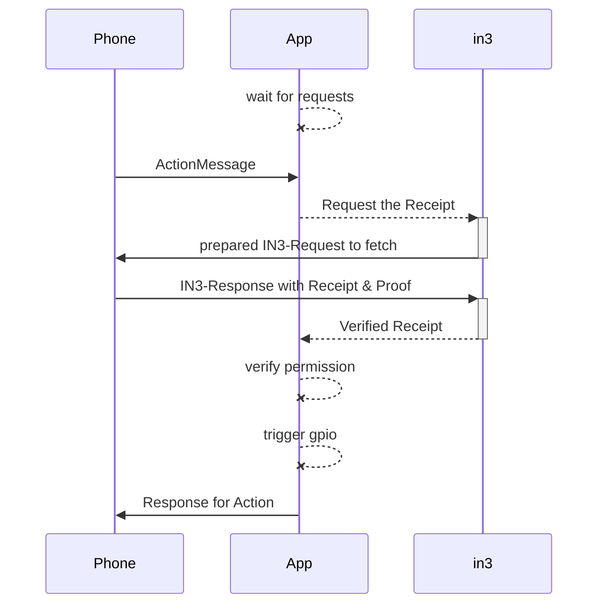
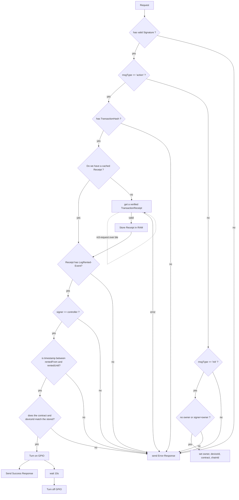

USN-Application with in3-core

The Application is receiveing a BLE-Message and verifies it. If valid a GPIO is triggered.

The main Participants in this process is :

1. The sender of the Message (`Phone`)
2. The proccessor (`App`) which is the main-Application on the board.
3. the incubed-Library (`in3`) which is handling the verification.



# Verification-Flow





# Minimal Verification Implementation

The Application will simply accept a request to trigger a action. This request will then be verified and executed by chaing the state of a GPIO-Pin. The Application will be responsible to create the communication-layer, which is done as a bluetooth-connection.

### Communication-Layer
The Bluetooth-Connection will enable to send simply messages from the device and to the device. This means after the pairing, The CommunicationLayer implements a function for sending and receiving Messages:

```c
typedef int (*in3_transport_send)(char** urls, int urls_len, char* payload, in3_response_t* results);
```

Once the ble-response has been received the results-array is offers structs like :

```c
/** response-object. 
 * 
 * if the error has a length>0 the response will be rejected
 */
typedef struct {
  sb_t error;  /**< a stringbuilder to add any errors! */
  sb_t result; /**< a stringbuilder to add the result */
} in3_response_t;
```

The implemenation simply needs to add the response to either result or error:

```c
sb_add_chars(&result->result, received_data);
```

## Incoming Requests

The payload of a request is a json-object which looks like this:

```js
{
    /** 
     * identifier of the message in order to avoid duplicate messages.
     */
    msgId: number
    /**
     * marks the type of a message
     */
    msgType: 'init' | 'action' | 'in3Request'| 'in3Response'

    /**
     * the human readable url of the device
     * example: bike@myCompany
     */
    url: string

    /**
     * Unix format timestamp (in seconds) of the message. Used to avoid using same message twice.
     */
    timestamp: number
    
}
```

Depending on the msgType, the object holds additional properties:

### Type: `init`

This message will store a new owner and contract. It can only be called, if:
- the owner provided the correct signature
- the owner is not set yet or the same as the current owner.

```js
{
  /**
   * hex address of the new or old owner of the device. (20bytes)
   */
  owner: string // hex

  /**
   * chainId of the contract as hexstring (32bytes)
   */
  chainId: string

/**
   * address of the contract (20bytes)
   */
  contract: string

  /**
   * deviceId as hexstring (32bytes)
   */
  deviceId: string

  /**
   * gpio-pin to trigger.
   * At the moment we only support action for open => set GPIO to 1 and close => set GPIO to 0
   */
  gpio: number

  /** 
   * signature of the sender of the message
   */
  signature: {
      /**
       * the message as conacted string (optional)
       */
      message?: string
      /**
       * hash of the message (sha3)
       */
      messageHash: string // bytes32
      /**
       * Positive non-zero Integer signature.r
       */
      r: string // hex
      /**
       * Positive non-zero Integer signature.s
       */
      s: string // hex
      /**
       * Calculated curve point, or identity element O.
       */
      v: string // hex
      /**
       * optional: the concated signature of r+s+v
       */
      signature?: string // hex
  }

}
```

a request should be handled by following these steps:

1. building the messagehash:

   ```ts
   const message = msg.owner + msg.chainId + msg.contract + msg.deviceId + msg.gpio;
   const messageHash = sha3(message);
   ```
2. verifiying the messageHash of the incoming request (`msg.signature.messageHash == messageHash` )
3. getting the signer of the message

   ```ts
   const signer = pubToAddress( ecrecover(messageHash, msg.signature.v, msg.signature.r, msg.signature.s ))
   ```
4. verifying that either there is no owner or the current owner == signer
5. setting the values ( `msg.owner`, `msg.chainId`, `msg.contract`, `msg.deviceId` and `msg.gpio`) in the permanent storage
6. returning a simple response:

   ```js
   {
      msgId : msg.msgId,
      result: 'success' | 'error'
   }
   ```


### Type: `action`

A Action message will trigger a GPIO to change it's state.

```js
{
     /**
     * Abstract physical action. Right now only 'open' (GPIO:1) and 'close' (GPIO:0) are supported.
     */
    action: string
    /**
     * optional Object containing data that the physical device expects to trigger change of state.
     */
    metadata?: any

    /**
     * the chain of the contract used.
     */
    chainId?: string

    /**
     * the transactionHash of the transaction the user sent in order to rent this device.
     */
    transactionHash?: string

    /** 
     * signature of the sender of the message
     */
    signature: {
        /**
         * the message as conacted string (optional)
         */
        message?: string
        /**
         * hash of the message (sha3)
         */
        messageHash: string // bytes32
        /**
         * Positive non-zero Integer signature.r
         */
        r: string // hex
        /**
         * Positive non-zero Integer signature.s
         */
        s: string // hex
        /**
         * Calculated curve point, or identity element O.
         */
        v: string // hex
        /**
         * optional: the concated signature of r+s+v
         */
        signature?: string // hex
    }
    
}
```

#### proccessing a action-message:

1. verifying the transaction, by asking incubed for the Receipt.
   
   ```c
	sprintf(params, "[\"%s\"]", tx_hash);
    in3_ctx_t* ctx = in3_client_rpc_ctx(in3,"eth_getTransactionReceipt",params);
    
    // read the data
    d_token_t* receipt = d_get(ctx->responses[0], K_RESULT);
    
        
    if (!receipt) {

        d_token_t* error = d_get(ctx->responses[0], K_ERROR);
        // report error (either error or ctx->error) and reject
        free_ctx(ctx);
        return -1;
    }
        
        
    // read and verify the receipt....
    
    free_ctx(ctx);
   ```
   
2. checking for an LogRented-Event in the response

   ```js 
   // make sure the receipt exists
   if (!response[0].result) throw new Error()
   const logs = repsonses[0].result.logs
   // and has logs
   if (!logs || logs.length===0) throw new Error()
   for (const log of logs) {
     if (log.topics && log.topics[0]==='0x9123e6a7c5d144bd06140643c88de8e01adcbb24350190c02218a4435c7041f8') { //signature of the logRentedEvent
       // found a event
       const deviceId = log.topics[2] // the deviceId
       const controller = '0x'+log.data.substr(26,40) // address of the controller
       const rentedFrom = parseInt(log.data.substr(2+64,64),16) // the timestamp of rentedFrom
       const rentedUntil= parseInt(log.data.substr(2+2*64,64),16) // the timestamp of rentedFrom
     }
   }
   ```

3. if the event was found, we need to verify the signature

   ```js
   const message = msg.url + msg.timestamp + msg.action +JSON.stringify(msg.metadata) // in our case JSON.stringify(msg.metadata) is always '{}'
   const messageHash = sha3(message);
   ```
4. verifiying the messageHash of the incoming request (`msg.signature.messageHash == messageHash` )
5. getting the signer of the message

   ```ts
   const signer = pubToAddress( ecrecover(messageHash, msg.signature.v, msg.signature.r, msg.signature.s ))
   ```
6. checking if the booking is valid:
   ```js
   const now = Math.round(Date.now()/1000) // get the current unix timestamp in s
   if (signer == controller && rentedFrom<now && rentedUntil>now && storage.deviceId==deviceId)
      // trigger gpio
   else
      throw new Error('no access')
   ```
7. trigger thr GPIO (if valid)
8. returning a simple response:

   ```js
   {
      msgId : msg.msgId,
      result: 'success' | 'error'
   }
   ```


### Type: `in3Response`

A message of type `in3Response` will be handled as response from a in3-request and its `responses` should be passed directly to the in3-library.

```ts
{
  /**
   * array of json-rpc-responses.
   */
  responses: {
    /**
     * json-rpc-version : '2.0'
     */
    jsonrpc: string

    /**
     * request-id
     */
    id: number | string

    /**
     * the result of the request
     */
    result: any

    /**
     * the error in case it failed
     */
    error: any

    /**
     * the in3-data including the proof
     */
    in3?:any

  }[]
}
```

